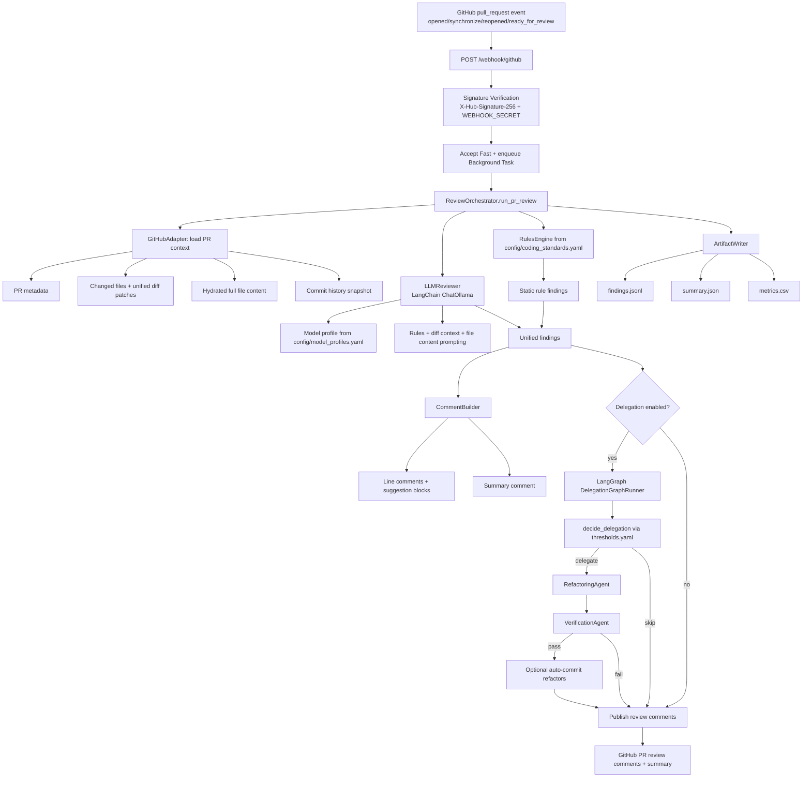
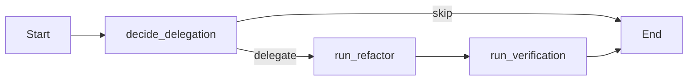

# Architecture

## Current Runtime Flow (Webhook-First)

## API Surface
- `POST /webhook/github`: verifies signature, validates PR event/action, returns immediately with `run_id`.
- `GET /webhook/status/{run_id}`: returns in-memory run status (`accepted|running|success|failed`) plus artifact paths/errors.
- `GET /webhook/artifacts/{run_id}`: returns a ZIP of `summary.json`, `findings.jsonl`, `metrics.csv` once run succeeds.

## Multi-Agent Delegation Graph (LangGraph)

- `decide_delegation`: uses `config/thresholds.yaml` (total findings, high severity concentration, quality/security count, complexity trigger rule, low-test-coverage signal).
- `run_refactor`: applies LLM-guided safe refactors and bounded heuristic transforms.
- `run_verification`: validates transformed files (e.g., Python syntax parse) before any optional commit-back.

## Safety and Loop Prevention
- HMAC webhook signature validation is mandatory.
- GitHub API calls use retry/backoff handling in `GithubAdapter`.
- Comment publishing handles unresolved line anchors with fallback behavior to avoid full-run failure.
- Auto-commit guardrail: skip if latest PR commit was generated by refactor agent (`chore(refactor-agent):...`).
- Auto-commit guardrail: cap automated refactor commits per PR.
- Webhook guardrail: ignore self-generated refactor commits to prevent re-trigger loops.

## Observability and Reproducibility
- Per-run artifacts are written to `artifacts/webhook/<run_id>/`.
- Webhook lifecycle logs are appended to `artifacts/webhook/webhook.log`.
- Failure traces are written to `artifacts/webhook/error_<delivery_id>.log`.
- Run metadata includes `run_id`, `head_sha`, model/profile, delegation status, commit count, and handoff log.
- LangSmith tracing wraps major stages (`static_analysis`, `llm_review`, publish steps, artifact write) when enabled.

## Core Components
- `src/review_agent/webhook_listener.py`: webhook ingress, async background execution, run-state tracking.
- `src/review_agent/review_orchestrator.py`: main pipeline orchestration, delegation integration, publishing, artifacts.
- `src/review_agent/github_adapter.py`: GitHub API access (context, diffs, files, commits, comments, optional commits).
- `src/review_agent/rules_engine.py`: loads coding standards from YAML and runs static checks.
- `src/review_agent/analyzers/llm_reviewer.py`: LLM-driven semantic review with rule-aware prompts.
- `src/review_agent/agents/graph.py`: delegation state graph.
- `src/review_agent/agents/refactoring_agent.py`: safe refactor generation + rollback on invalid output.
