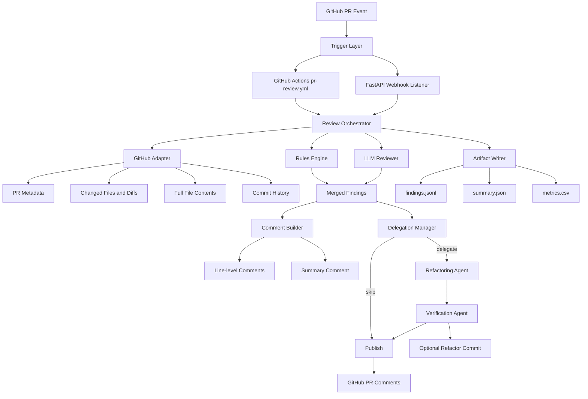
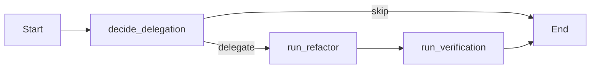

# Architecture

## High-Level Flow

## Multi-Agent Graph (LangGraph)

## Key Design Guarantees
- Deterministic ordering and deduplication of findings.
- Structured outputs with run metadata and commit-history count.
- Safe bounded refactoring actions plus verification gate.
- Optional commit-back path to PR branch with explanatory summary comment.
